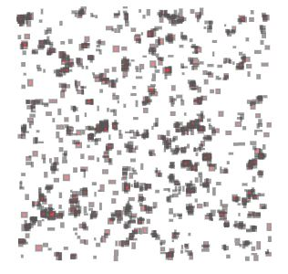

## advent_of_code_2018
December Fun
https://adventofcode.com/2018

Written in python 3 in jupyter notebooks prior then pulled into .py files.  
pylint used on *some* files

Day three code creates a multipolygon shapefile as output,
visualization below.

